## Terraform-jenkins
# Configure Jenkins Box
- 1 - Spin up ec2-instance
- 2 - Install Java 8 --> yum install java-1.8.0-openjdk
- 3 - Downloand and Install Jenkins
    - wget -O /etc/yum.repos.d/jenkins.repo https://pkg.jenkins.io/redhat-stable/jenkins.repo
    - rpm --import https://pkg.jenkins.io/redhat-stable/jenkins.io.key
    - yum install jenkins
- 4 - Install Terraform plugin to Jenkins
    - Manage Jenkins -> Manage Plugins -> Avaiable -> Search Terraform
- 5 - Add Terraform to Global Tool Configuration
    - 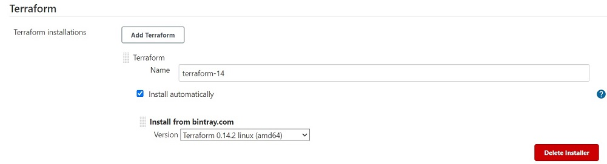
- 6 - Add Terraform Env to PATH
    - Pipeline Snytax -> Snippet Generator
    - 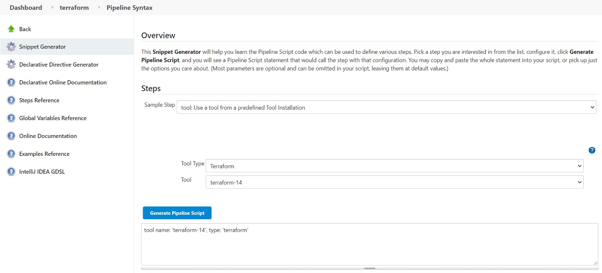
    - 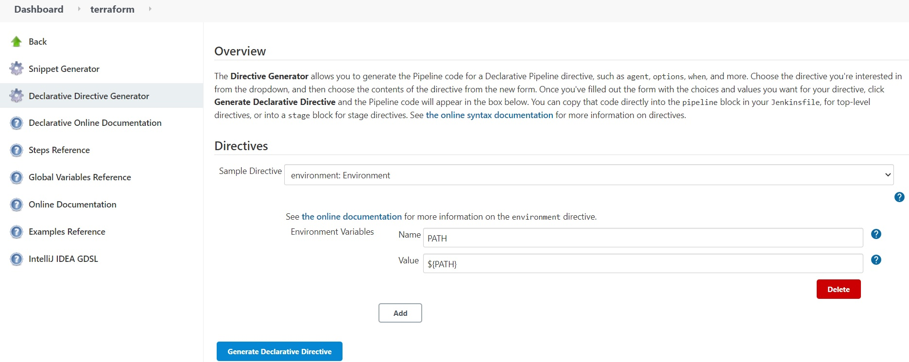 

# Resolve The Issues
- Issue 1 - Jenkins Output show that we created 2 Subnets(1 for Dev Env and 1 for Prod Env) Succesfully. However when we check from AWS VPC console only Public-Subnet-Prod created.
    - 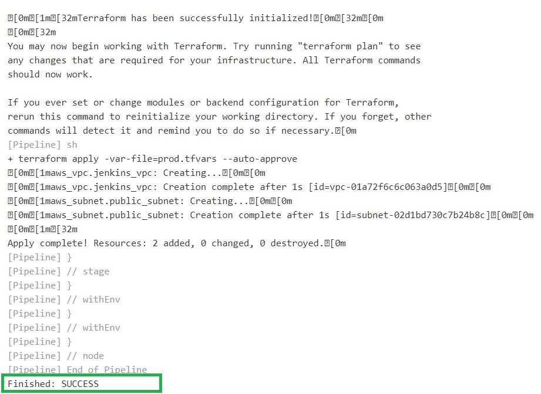
    - 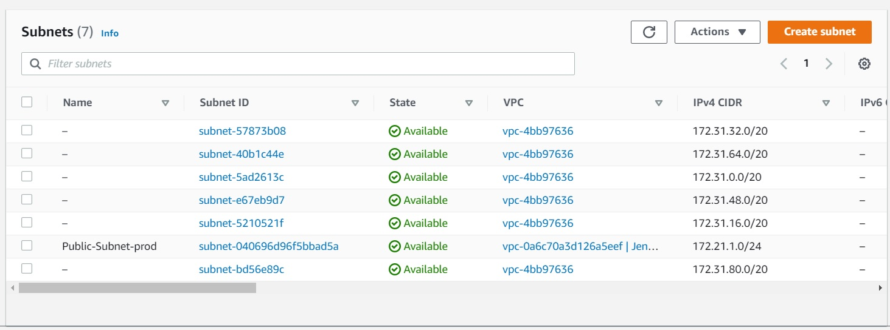
    - 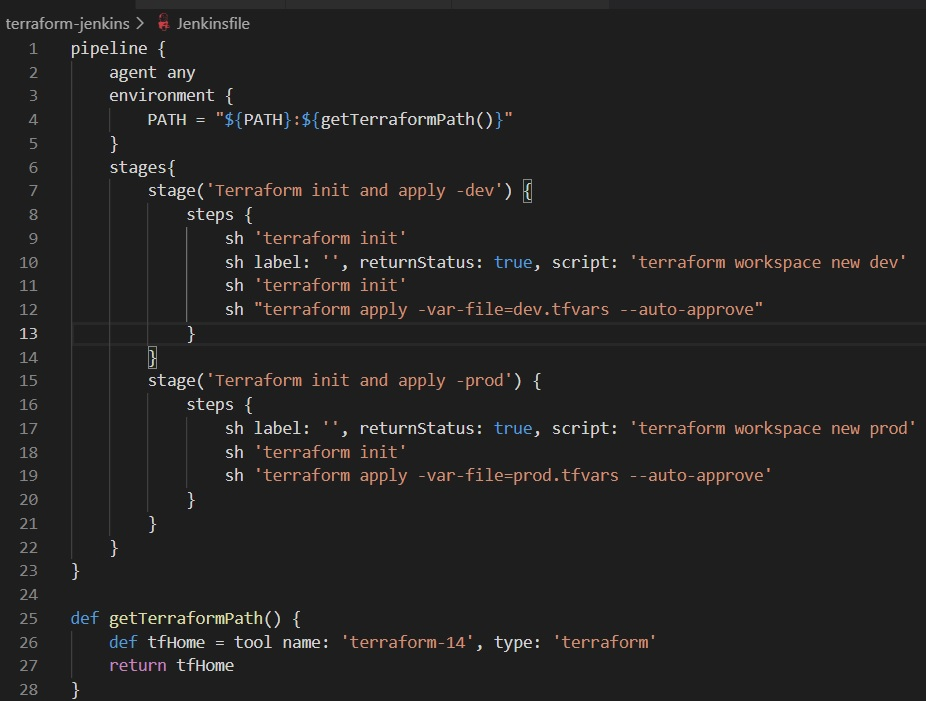

- Solution 1 - Terraform stay the last env that we create. In this case last env is prod env, because of this terraform skip dev env and only create Subnet for prod env. In order to fix this issue we have change env in our Jenkinsfile. We have to add 
    - "terraform workspace select dev"
    - "terraform workspace select prod"
command.
    - 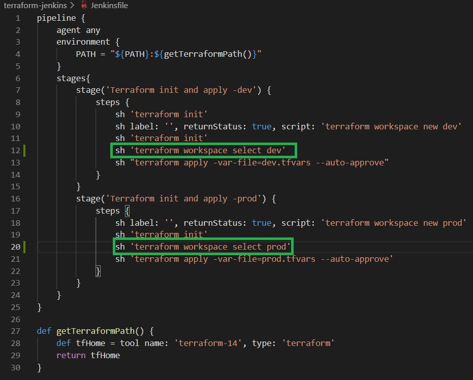
    - 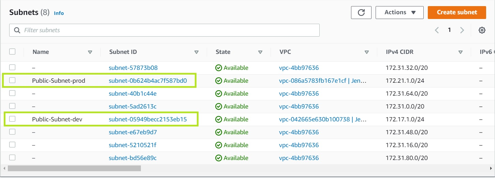

- Issue 2 - I already installed ansible to Jenkins Box and also installed Ansible plugin to Jenkins.However I received "ansible-playbook" not found error.
    - 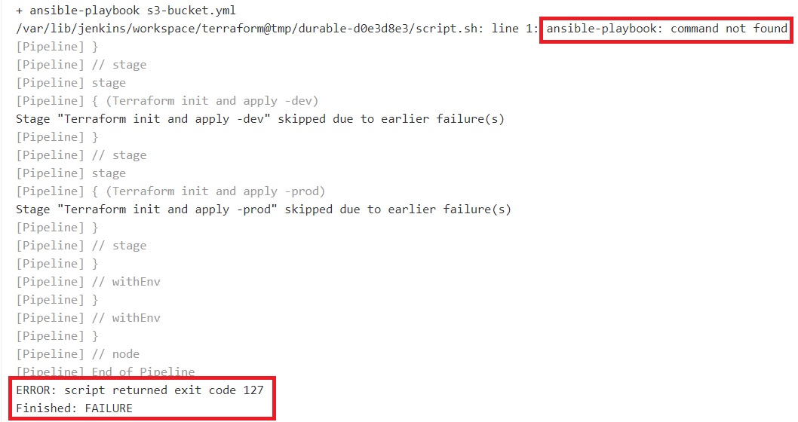

- Solution 2 - In order to fix this issue I add executable ansible file location to Path to ansible executables directory and, add ansible home environment to Jenkinsfile
    - 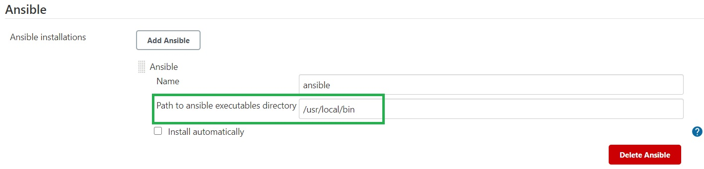

- Issue 3 - I am running ansible-playbook with sudo privilege. Jenkins console output error mesage "module_stderr": "sudo: a password is required"
    - 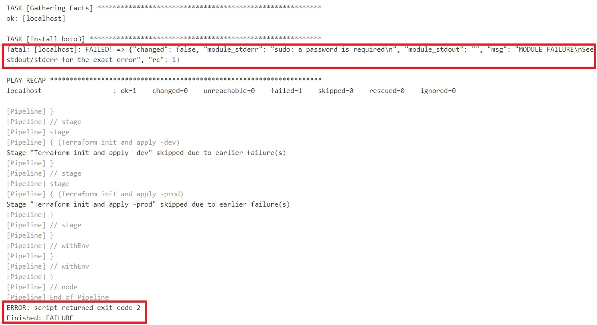

- Solution 3 - Jenkins running everything under the "jenkins" user. In order to solve this problem we have to add "jenkins" user to sudoers file.
    - ssh -i <pemfile> <username@ipaddress>
    - visudo --> jenkins    ALL=(ALL)   NOPASSWD:ALL
    - 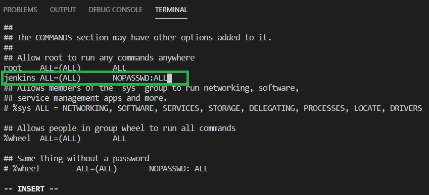
    - 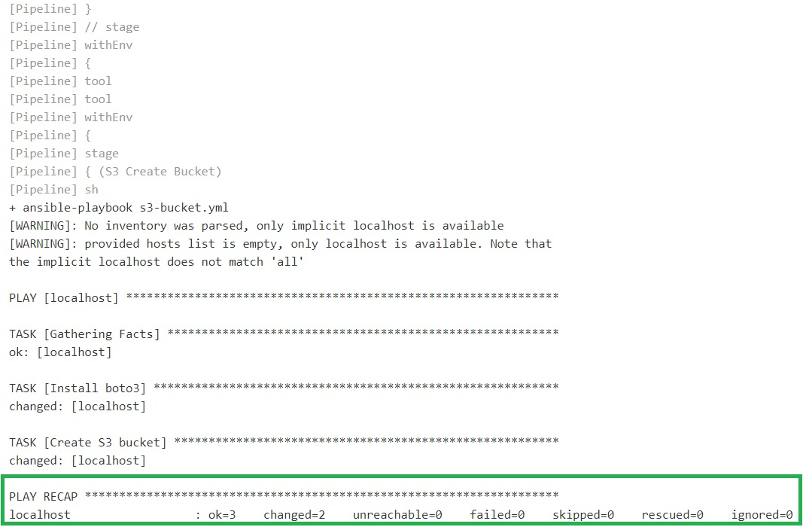